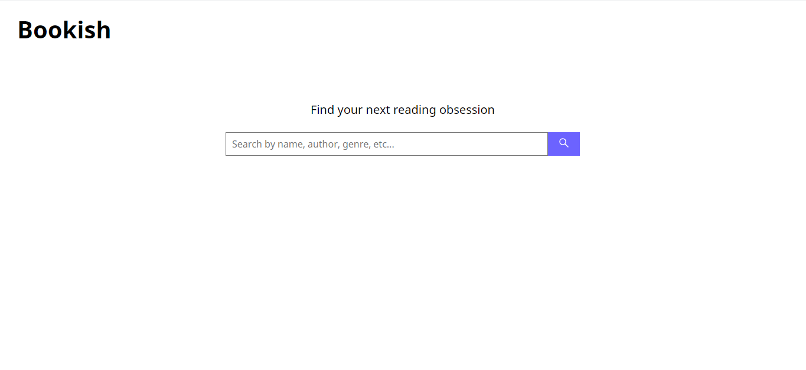
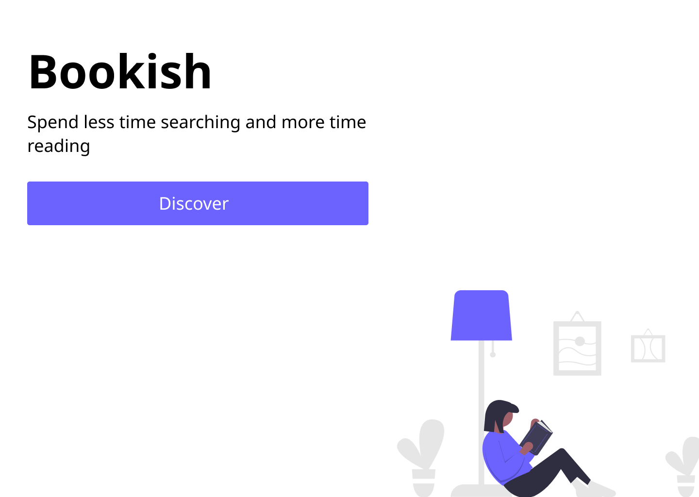

<h1 align="center"></h1>

### 📚 What is Bookish?

Bookish is a **book finder app**. You can search by name, author, genre and etc and Bookish will return the most relevant results for your search

 
You can also click on the book to be redirected to it's page in **Google Books**, where you can find more information and buy the volume

### 🎨 The Design of Bookish

The design of Bookish was conceptualized in **Figma** and the idea behind it was to be really slick and minimal, while still presenting vivid coloring to its most important elements

### 👨‍💻 How it was built?

Bookish was made on **React** integrated with the **Google Books API**. I used the **Routes library** to make the navigation between the home page and the search page and used **Axios** to handle the API requests, with **useState** and **useEffect** to handle data asynchronously and render the result of the query in the DOM.

### 🔑 The Google Books API

I really enjoyed working with the Google Books API. It's really well documented and easy to setup. I highly recommend using Google APIs for your first project with APIs. 

### 📥 Cloning Bookish

If you want to download Bookish and make your own functionalities and/or version, you can just clone the repository using this command on your git console:

``git clone https://github.com/mateusrizzo/bookish.git``

Also, you gonna need Yarn to start the front-end. It's really easy to download and setup. After you downloaded it, just navigate your console to the project page and execute:

``yarn start``

I can't wait to see other functionalities and version pop up around here!

 with 💜 Mateus Rizzo 

